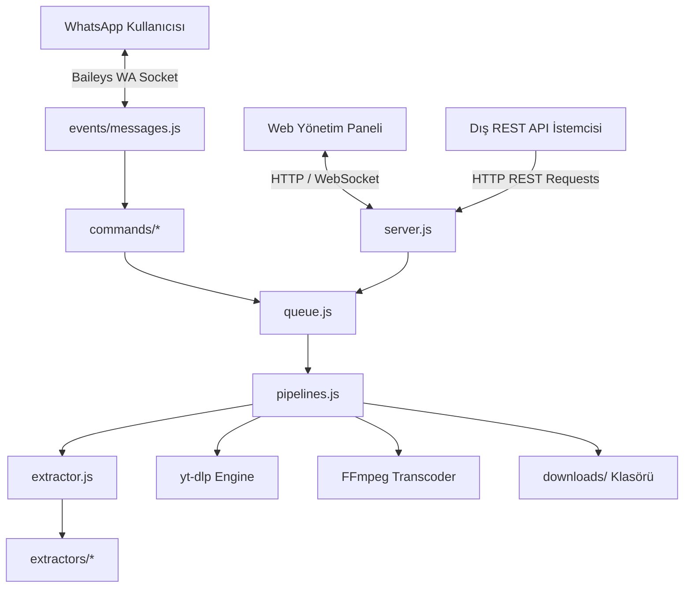
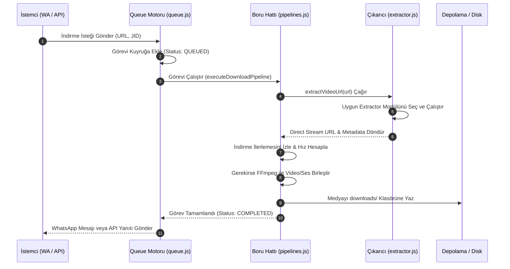
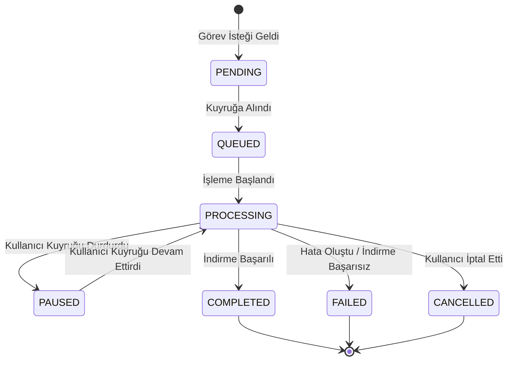
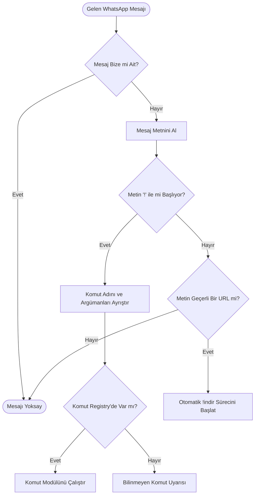

# 🎬 HDWP İndirici & WhatsApp Bot (v3.0.17) — Tam Teknik Dokümantasyon


**HDWP İndirici**, WhatsApp üzerinden gönderilen veya HTTP REST API aracılığıyla iletilen film, dizi, sosyal medya videoları, bulut depolama dosyaları ve doğrudan medya bağlantılarını yüksek performansla ayıklayan (extract), indiren, dönüştüren ve kullanıcılara sunan **endüstriyel seviyede bir WhatsApp Botu, REST API Servisi, Akıllı Kuyruk Motoru ve Gerçek Zamanlı Web Yönetim Paneli** sistemidir.

---

## 📑 İÇİNDEKİLER

1. [📌 PROJE ÖZETİ VE MİMARİ AÇIKLAMA](#1-proje-özeti-ve-mimari-açıklama)
2. [✨ ÖNE ÇIKAN TÜM ÖZELLİKLER](#2-öne-çıkan-tüm-özellikler)
3. [📐 SİSTEM MİMARİSİ VE AKIŞ DİYAGRAMLARI](#3-sistem-mimarisi-ve-akiş-diyagramlari)
   - [3.1. Genel Sistem Bağlamı](#31-genel-sistem-bağlami)
   - [3.2. İndirme ve Boru Hattı (Pipeline) Akışı](#32-indirme-ve-boru-hatti-pipeline-akişi)
   - [3.3. Akıllı Kuyruk (Queue) Durum Makinesi](#33-akilli-kuyruk-queue-durum-makinesi)
   - [3.4. WhatsApp Olay ve Komut Dinleme Döngüsü](#34-whatsapp-olay-ve-komut-dinleme-döngüsü)
4. [📂 DETAYLI DOSYA VE DİZİN YAPISI REHBERİ](#4-detayli-dosya-ve-dizin-yapisi-rehberi)
5. [🧠 ÇEKİRDEK SİSTEM MODÜLLERİ TEKNİK DETAYLARI](#5-çekirdek-sistem-modülleri-teknik-detaylari)
   - [5.1. `bot.js` — Ana Başlatıcı ve Baileys Soket Bağlantısı](#51-botjs--ana-başlatici-ve-baileys-soket-bağlantisi)
   - [5.2. `server.js` — Express HTTP ve WebSocket Sunucusu](#52-serverjs--express-http-ve-websocket-sunucusu)
   - [5.3. `config.js` — Konfigürasyon ve Sistem Yardımcıları](#53-configjs--konfigürasyon-ve-sistem-yardimcilari)
   - [5.4. `queue.js` — Öncelikli Görev Kuyruk Motoru](#54-queuejs--öncelikli-görev-kuyruk-motoru)
   - [5.5. `pipelines.js` — Medya İndirme ve İşleme Boru Hattı](#55-pipelinesjs--medya-indirme-ve-işleme-boru-hatti)
   - [5.6. `extractor.js` — Merkezi Çıkarıcı Dağıtıcı (Dispatcher)](#56-extractorjs--merkezi-çikarici-dağitici-dispatcher)
   - [5.7. `cache.js` — Bellek ve Dosya Önbellekleme Modülü](#57-cachejs--bellek-ve-dosya-önbellekleme-modülü)
   - [5.8. `tracker.js` — Bant Genişliği ve İndirme Hız Takibi](#58-trackerjs--bant-genişliği-ve-indirme-hiz-takibi)
   - [5.9. `events/connection.js` — WhatsApp Bağlantı Durumu Yönetimi](#59-eventsconnectionjs--whatsapp-bağlanti-durumu-yönetimi)
   - [5.10. `events/messages.js` — Gelen Mesaj İşleyici ve Ayrıştırıcı](#510-eventsmessagesjs--gelen-mesaj-işleyici-ve-ayriştirici)
6. [🌐 ÇIKARICI (EXTRACTOR) MODÜLLERİ DETAYLI REHBERİ](#6-çikarici-extractor-modülleri-detayli-rehberi)
   - [6.1. Sosyal Medya ve Video Platformları](#61-sosyal-medya-ve-video-platformlari)
   - [6.2. Bulut Depolama Platformları](#62-bulut-depolama-platformlari)
   - [6.3. Dizi, Film ve Anime Platformları](#63-dizi-film-ve-anime-platformlari)
   - [6.4. APK ve Uygulama Depoları](#64-apk-ve-uygulama-depolari)
   - [6.5. Özel / Yetişkin İçerik Platformları](#65-özel--yetişkin-içerik-platformlari)
7. [📱 WHATSAPP KOMUT KILAVUZU (28 KOMUTUN TAMAMI)](#7-whatsapp-komut-kilavuzu-28-komutun-tamami)
8. [📡 REST API REFERANS SARTNAMESİ (TAM SPEKTRUM)](#8-rest-api-referans-şartnamesi-tam-spektrum)
   - [8.1. Medya Bağlantısı Ayıklama (Extraction) API](#81-medya-bağlantisi-ayiklama-extraction-api)
   - [8.2. İndirme ve Görev Yönetimi API](#82-indirme-ve-görev-yönetimi-api)
   - [8.3. Dizi ve Sezon Bölüm API](#83-dizi-ve-sezon-bölüm-api)
   - [8.4. Sistem Durumu ve Teşhis API](#84-sistem-durumu-ve-teşhis-api)
   - [8.5. Medya Kasa ve Dosya Yönetimi API](#85-medya-kasa-ve-dosya-yönetimi-api)
   - [8.6. Oturum ve Eşleşme (Pairing) API](#86-oturum-ve-eşleşme-pairing-api)
   - [8.7. Sistem Ayarları ve Log Yönetimi API](#87-sistem-ayarlari-ve-log-yönetimi-api)
9. [🔌 CANLI TAKİP WEBSOCKET PROTOKOLÜ](#9-canli-takip-websocket-protokolü)
10. [🛠️ SİSTEM KURULUM VE YAPILANDIRMA REHBERİ](#10-sistem-kurulum-ve-yapilandirma-rehberi)
    - [10.1. Linux (Ubuntu / Debian) Kurulumu](#101-linux-ubuntu--debian-kurulumu)
    - [10.2. Windows Server Kurulumu](#102-windows-server-kurulumu)
    - [10.3. Docker ve Docker Compose Kurulumu](#103-docker-ve-docker-compose-kurulumu)
11. [⚙️ ORTAM DEĞİŞKENLERİ VE CONFIG.JSON REFERANSI](#11-ortam-değişkenleri-ve-configjson-referansi)
12. [🚀 PRODUCTION DAĞITIM VE PM2 YÖNETİMİ](#12-production-dağitim-ve-pm2-yönetimi)
13. [🛡️ GÜVENLİK, BRUTE-FORCE VE RATE LIMITING](#13-güvenlik-brute-force-ve-rate-limiting)
14. [🧩 GELIŞTIRICI REHBERI: YENI MODÜL EKLEME](#14-geliştirici-rehberi-yeni-modül-ekleme)
    - [14.1. Yeni Bir Extractor Yazma](#141-yeni-bir-extractor-yazma)
    - [14.2. Yeni Bir WhatsApp Komutu Yazma](#142-yeni-bir-whatsapp-komutu-yazma)
15. [🔍 KAPSAMLI SORUN GİDERME VE SIK SORULAN SORULAR](#15-kapsamli-sorun-giderme-ve-sik-sorulan-sorular)
16. [📄 LİSANS VE AÇIK KAYNAK DESTEĞİ](#16-lisans-ve-açik-kaynak-desteği)

---

## 1. 📌 PROJE ÖZETİ VE MİMARİ AÇIKLAMA

**HDWP İndirici (v3.0.17)**, modern web ekosistemindeki çeşitli medya platformlarından içerik indirme, dönüştürme ve iletme süreçlerini otomatikleştirmek üzere tasarlanmış, yüksek oranda modüler ve olay tabanlı (event-driven) bir Node.js uygulamasıdır.

Sistem, iki temel arayüz üzerinden çalışır:
1. **WhatsApp İletişim Arayüzü (`Baileys v6`):** Kullanıcıların sohbet ekranından komutlar göndererek veya doğrudan link paylaşarak medya indirmelerini sağlayan WhatsApp bot katmanı.
2. **HTTP REST API ve Web Yönetim Paneli (`Express.js v5` & `WebSockets`):** Dış sistemlerin (web siteleri, mobil uygulamalar, otomasyon araçları) bot altyapısını bir medya çıkarma ve indirme servisi olarak kullanmasını sağlayan güçlü API katmanı.

Sistemin kalbinde, tüm indirme isteklerini asenkron olarak sıraya sokan, önceliklendiren, iptal eden ve donanım kaynaklarını koruyan **Akıllı Kuyruk Motoru (`queue.js`)** yer almaktadır. Medya indirme ve dönüştürme işlemleri ise `yt-dlp`, `ffmpeg`, `got-scraping`, `puppeteer-extra-plugin-stealth` ve özel yazılmış **25+ extractor modülü** vasıtasıyla yürütülmektedir.

---

## 2. ✨ ÖNE ÇIKAN TÜM ÖZELLİKLER

### 🤖 WhatsApp Bot Katmanı
- **Sürdürülebilir Oturum Yönetimi:** `@whiskeysockets/baileys` ile çoklu dosya oturumu saklama (`useMultiFileAuthState`), otomatik yeniden bağlanma ve oturum yedekleme/geri yükleme.
- **Telefon Numarası İle Eşleşme (Pairing Code):** QR kod taratma zorunluluğunu ortadan kaldıran, WhatsApp Pair Code desteği.
- **Dinamik Komut Yükleyici (Dynamic Command Loader):** `./commands/` klasörü altındaki tüm `.js` dosyalarını otomatik algılayarak çalışma zamanında (runtime) sıcak yükleme (hot-reload).
- **Yönetici ve Yetki Kontrolü:** Sadece belirli yetkili jid/telefon numaralarına özel komut erişim izinleri.

### 🌐 REST API & Microservice Desteği
- **Bağımsız Medya Çıkarma API (`/api/extract`):** İndirme başlatmadan sadece medyanın ham direct stream URL'ini alma.
- **Asenkron İndirme Başlatma API (`/api/indir` & `/api/indir-multiple`):** İstekleri kuyruğa ekleyip benzersiz `taskId` döndürme.
- **Dizi ve Sezon Çekme API (`/api/fetch-episodes`):** Dizi web sitelerinden sezon ve bölüm yapılarını JSON olarak çekme.
- **Medya Kasa API (`/api/files`):** İndirilen dosyaları listeleme, silme, ZIP arşivine dönüştürme.

### 📊 Gerçek Zamanlı Yönetim Paneli (Web Dashboard)
- **Canlı Metrik Takibi:** Anlık CPU, RAM, Disk Kullanımı (Free/Total GB), İndirme Hızı (MB/s).
- **Canlı Log Akışı:** Sunucu loglarını kesintisiz dinleyen WebSocket soket sunucusu.
- **Görsel Kuyruk Yönetimi:** Sürükle-bırak tadında görev önceliklendirme, duraklatma, devam ettirme ve tek tıkla iptal.

### 🛡️ Güvenlik & Sistem Dayanıklılığı
- **Brute-Force ve IP Engelleme:** Web paneline yönelik hatalı oturum açma denemelerini tespit edip IP engeli koyan `loginAttempts` koruması.
- **Otomatik Captcha Yönetimi:** Discord botu veya harici Captcha doğrulama servisleriyle entegre çalışan arkaplan Captcha Poller mekanizması.
- **Otomatik Temizlik (Garbage Collector):** İndirilen medyalardan belirlenen süre (`DOWNLOAD_MAX_AGE_HOURS`) veya disk boyutu (`MAX_DOWNLOADS_CACHE_GB`) sınırını aşanları otomatik temizleyen disk yöneticisi.

---

## 3. 📐 SİSTEM MİMARİSİ VE AKIŞ DİYAGRAMLARI

### 3.1. Genel Sistem Bağlamı



---

### 3.2. İndirme ve Boru Hattı (Pipeline) Akışı



---

### 3.3. Akıllı Kuyruk (Queue) Durum Makinesi



---

### 3.4. WhatsApp Olay ve Komut Dinleme Döngüsü



---

## 4. 📂 DETAYLI DOSYA VE DİZİN YAPISI REHBERİ

```
wpbot/
├── .env                       # Ortam değişkenleri ve gizli anahtarlar
├── .env.example               # Örnek ortam değişkenleri şablonu
├── .gitignore                 # Git tarafından yoksayılacak dosya tanımları
├── PROMPT.md                  # Sistem talimatları ve mimari referanslar
├── auth_info_session/         # Baileys WhatsApp oturum verileri ve geçmiş jid dosyaları
│   ├── creds.json             # Oturum kimlik bilgileri
│   ├── history.json           # Başarılı indirme geçmişi
│   └── errors.json            # Hata kayıt günlüğü
├── baglan.bat                 # Windows kolay başlatma scripti
├── baslat.bat                 # Windows bot başlatma scripti
├── baslat.sh                  # Linux bot başlatma scripti
├── bot.js                     # Ana Bot başlatıcı, Baileys soket yapılandırması
├── cache.js                   # Bellek ve dosya önbellekleme mekanizması
├── commands/                  # Dinamik WhatsApp komut modülleri
│   ├── bancheck.js            # Ban kontrolü
│   ├── banlar.js              # Yasaklı listesi
│   ├── botkontrol.js          # Bot aktiflik durumu
│   ├── bots.js                # Bot listesi
│   ├── captcha.js             # Captcha durumu
│   ├── cerez.js               # Cookie kontrolü
│   ├── coz.js                 # Captcha çözme komutu
│   ├── depo.js                # Depolama kontrolü
│   ├── devam.js               # Kuyruk devam ettirme
│   ├── disk.js                # Disk alan sorgulama
│   ├── dur.js                 # Kuyruk duraklatma
│   ├── durum.js               # Sistem durum metrikleri
│   ├── gecmis.js              # İndirme geçmişi
│   ├── gem.js                 # Sistem performans metriği
│   ├── grupsec.js             # Grup hedef seçimi
│   ├── guncelle.js            # Sistem güncelleme
│   ├── hatalar.js             # Hata log listesi
│   ├── hiz.js                 # Anlık indirme hızı
│   ├── indir.js               # Ana indirme komutu
│   ├── iptal.js               # Görev iptal etme
│   ├── komutekle.js           # Özel komut ekleme
│   ├── komutlar.js            # Komut listesi rehberi
│   ├── komutsil.js            # Özel komut silme
│   ├── kuyruk.js              # Kuyruk listesi
│   ├── patates.js             # Sistem yük testi / ping
│   ├── pingurl.js             # Canlılık ping adresi ayarlama
│   ├── tekrargonder.js        # Başarısız medyayı tekrar gönderme
│   └── temizle.js             # Kuyruk temizleme
├── config.js                  # Konfigürasyon yönetimi ve yardımcı fonksiyonlar
├── discordApi.js              # Discord Bot Captcha entegrasyon arayüzü
├── downloader.js              # Medya indirme sürücüsü ve akış kontrolü
├── downloads/                 # İndirilen dosyaların tutulduğu geçici dizin
├── dpi.bat                    # DPI bypass yardımcı scripti
├── ecosystem.config.cjs       # PM2 üretim ortamı yapılandırması
├── events/                    # WhatsApp olay dinleyicileri
│   ├── connection.js          # Bağlantı ve kopma olayları
│   └── messages.js            # Mesaj alma ve komut yönlendirme
├── extractor.js               # Merkezi medya çıkarma motoru
├── extractors/                # Özel site ve servis çıkarıcıları (25 Modül)
│   ├── animecix.js            # Animecix video/sezon extractor
│   ├── cloudmailru.js         # Cloud Mail.ru extractor
│   ├── dizisitesi.js          # Dizi siteleri extractor
│   ├── doeda.js               # Doeda extractor
│   ├── dramadizilerim.js      # Drama dizilerim extractor
│   ├── gdrive.js              # Google Drive extractor
│   ├── hdabla.js              # HdAbla extractor
│   ├── hdfilmcehennemi.js     # HD Film Cehennemi extractor
│   ├── hdkore.js              # HD Kore extractor
│   ├── hentaizm.js            # Hentaizm extractor
│   ├── instagram.js           # Instagram Reel/Video extractor
│   ├── itch.js                # Itch.io extractor
│   ├── liteapks.js            # LiteAPKs APK extractor
│   ├── mega.js                # Mega.nz extractor
│   ├── modyolo.js             # Modyolo APK extractor
│   ├── ninemod.js             # Ninemod extractor
│   ├── pornhub.js             # Pornhub extractor
│   ├── sezonlukdizi.js        # Sezonluk Dizi extractor
│   ├── terabox.js             # TeraBox extractor
│   ├── tiktok.js              # TikTok No-Watermark extractor
│   ├── turkifsahub.js         # Türk İfsa Hub extractor
│   ├── turkifsalar.js         # Türk İfsalar extractor
│   ├── turkporno.js           # Türk Porno extractor
│   ├── yabancidizi.js         # Yabancı Dizi extractor
│   └── yandex.js              # Yandex Disk extractor
├── goodbyedpi/                # DPI engelleri için GoodbyeDPI paketi
├── guncelle.bat               # Otomatik Git güncelleme scripti
├── package.json               # Proje bağımlılıkları ve npm betikleri
├── pipelines.js               # Medya işleme ve indirme hattı
├── queue.js                   # Asenkron görev kuyruk motoru
├── server.js                  # Express.js REST API ve WebSocket sunucusu
├── setup_linux.sh             # Linux otomatik kurulum betiği
├── tracker.js                 # Bant genişliği takip modülü
├── views/                     # Web arayüz şablonları
├── yt-dlp                     # Linux binary binary dosyası
└── yt-dlp.exe                 # Windows çalıştırılabilir dosyası
```

---

## 5. 🧠 ÇEKİRDEK SİSTEM MODÜLLERİ TEKNİK DETAYLARI

### 5.1. `bot.js` — Ana Başlatıcı ve Baileys Soket Bağlantısı
`bot.js`, uygulamanın giriş noktasıdır (entry point). Görevleri:
- `dotenv` ile çevre değişkenlerini yüklemek.
- `./commands/` klasöründeki tüm komut dosyalarını tarayıp `commands` Map yapısına yüklemek.
- `@whiskeysockets/baileys` kütüphanesini başlatmak ve oturum verilerini `auth_info_session` dizininde saklamak.
- `yt-dlp` sürümünü otomatik denetleyip `-U` parametresiyle arkaplanda güncellemek.
- Mesaj gönderimlerinde `sentMessageIds` Set'ine ekleme yaparak botun kendi mesajlarını tekrar işlemesini (loop) engellemek.

### 5.2. `server.js` — Express HTTP ve WebSocket Sunucusu
Uygulamanın REST API ve Web Dashboard katmanıdır:
- Port: `.env` üzerinden okunan `PORT` (Varsayılan: `7860`).
- **Statik Dosya Sunucusu:** `/downloads/` klasörünü doğrudan indirmeye açar.
- **WebSocket Broker:** `ws` kütüphanesi ile bağlantı kuran istemcilere anlık indirme durumlarını ve sistem loglarını yayınlar (`broadcastLog`).
- **Brute-Force Guard (`basicAuth`):** Hatalı şifre denemelerinde IP engeli koyar.
- **Captcha Poller:** Arkaplanda `http://127.0.0.1:8181/api/captcha` adresini 19 saniyede bir sorgulayarak yeni Captcha oluştuğunda WhatsApp üzerinden bildirim atar.

### 5.3. `config.js` — Konfigürasyon ve Sistem Yardımcıları
Proje genelinde ortak kullanılan ayarlar ve yardımcı fonksiyonlar:
- `readConfig()` ve `writeConfig()`: `config.json` dosyasını okur ve günceller.
- `cleanOldDownloads()`: İndirme klasöründeki dosyaların yaşını ve toplam boyutunu kontrol eder, `MAX_DOWNLOADS_CACHE_GB` aşıldığında en eski dosyayı siler.
- `getDiskUsage()`: Sunucunun toplam ve kullanılabilir disk alanını hesaplar.
- `getYtDlpCommand()`: İşletim sistemine uygun `yt-dlp` komut yolunu döner (`yt-dlp.exe` veya `./yt-dlp`).

### 5.4. `queue.js` — Öncelikli Görev Kuyruk Motoru
Tüm indirme isteklerini sıraya koyan dinamik kuyruk motorudur:
- **Eşzamanlı İşlem Sınırı:** Aynı anda işlenebilecek maksimum indirme sayısını kontrol eder.
- **Görev Durumları:** `queued`, `downloading`, `completed`, `failed`, `cancelled`.
- **Fonksiyonlar:** `addDownloadTask()`, `cancelDownloadTask()`, `prioritizeDownloadTask()`, `pauseQueue()`, `resumeQueue()`, `clearQueue()`.

### 5.5. `pipelines.js` — Medya İndirme ve İşleme Boru Hattı
İndirme işleminin gerçekleştiği teknik katmandır:
- URL'yi `extractor.js` üzerinden geçirerek doğrudan video adresini alır.
- HDS/HLS (m3u8), MP4 veya Torrent yayınlarını indirir.
- Gerekirse FFmpeg ile ses ve video akışlarını birleştirir (muxing).
- İndirme tamamlandığında dosyayı WhatsApp üzerinden iletir veya sunucu diskine kaydeder.

### 5.6. `extractor.js` — Merkezi Çıkarıcı Dağıtıcı (Dispatcher)
İstemciden gelen bir URL'nin hangi siteye ait olduğunu regex ve domain analizi ile tespit eder ve ilgili `extractors/*.js` modülüne yönlendirir.

---

## 6. 🌐 ÇIKARICI (EXTRACTOR) MODÜLLERİ DETAYLI REHBERİ

Sistemde bulunan 25 özel çıkarıcı modülün desteklediği platformlar ve özellikleri:

| Modül Adı | Desteklenen Domain / Platform | Açıklama ve Çıkarma Yöntemi |
| :--- | :--- | :--- |
| `instagram.js` | `instagram.com` | Reel, Post ve Story videolarını filogramsız MP4 olarak çıkartır. |
| `tiktok.js` | `tiktok.com` | TikTok videolarını filogramsız (No-Watermark) indirir. |
| `mega.js` | `mega.nz` | Mega.nz bulut depolama linklerini `megajs` SDK'sı ile indirir. |
| `gdrive.js` | `drive.google.com` | Google Drive doğrudan indirme bağlantılarını oluşturur. |
| `yandex.js` | `disk.yandex.com`, `yadi.sk` | Yandex Disk API üzerinden indirme URL'si elde eder. |
| `terabox.js` | `terabox.com`, `teraboxapp.com` | TeraBox paylaşımlarından video stream linkini söker. |
| `animecix.js` | `animecix.net` | Anime bölümlerini, m3u8 playlistlerini ve sezon yapılarını çeker. |
| `hdfilmcehennemi.js` | `hdfilmcehennemi.life` vb. | Film ve dizilerin player kaynaklarını (Rapidrame vb.) deşifre eder. |
| `hdkore.js` | `hdkore.org` | Kore dizilerinin video ve altyazı kaynaklarını çıkarır. |
| `liteapks.js` | `liteapks.com` | Android APK ve MOD dosyalarını doğrudan indirmeye sunar. |
| `modyolo.js` | `modyolo.com` | Modyolo APK indirme bağlantılarını çözer. |
| `mediafire.js` | `mediafire.com` | MediaFire dosyalarını doğrudan indirme bağlantısına dönüştürür. |
| `pixeldrain.js` | `pixeldrain.com` | Pixeldrain paylaşımlarından direct API indirme bağlantısı oluşturur. |
| `dropbox.js` | `dropbox.com` | Dropbox paylaşım linklerini doğrudan indirme bağlantısına dönüştürür. |
| `wetransfer.js` | `wetransfer.com` | WeTransfer transfer paketlerini API üzerinden indirmeye hazırlar. |
| `dizipal.js` | `dizipal*` | Dizipal oyuncu kaynaklarından HLS/MP4 akış bağlantılarını deşifre eder. |
| `fullhdfilmizlesene.js` | `fullhdfilmizlesene.*` | FullHDFilmIzlesene film player iframe kaynaklarını ayıklar. |
| `filmmodu.js` | `filmmodu.*` | FilmModu sinema player kaynaklarını çıkarır. |
| `apkmirror.js` | `apkmirror.com` | APKMirror detay sayfalarından doğrudan APK dosya bağlantısı söker. |
| `apkpure.js` | `apkpure.com` | APKPure platformundan doğrudan APK/XAPK indirme URL'si elde eder. |
| `happymod.js` | `happymod.com` | HappyMod hileli ve modlu APK indirme bağlantılarını ayıklar. |
| `mangadenizi.js` | `mangadenizi.com` | MangaDenizi bölüm resimlerini çekip otomatik **PDF** oluşturur. |
| `asurascans.js` | `asurascans.com` / `asuracomic.net` | AsuraScans manhwa bölümlerini **PDF** belgesi olarak derler. |
| `webtoontr.js` | `webtoontr.com` | WebtoonTR webtoon resim sayfalarını tek bir **PDF** dosyası yapar. |
| `mangatr.js` | `mangatr.net` / `serimanga.com` | MangaTR, SeriManga ve TempestScans manga sayfalarını **PDF**'e çevirir. |
| `cloudmailru.js` | `cloud.mail.ru` | Mail.ru bulut depolama dosyalarını çeker. |
| `doeda.js` | `doeda.com` | Doeda video oynatıcı kaynaklarını çıkarır. |
| `sezonlukdizi.js` | `sezonlukdizi.vip` | Sezonluk Dizi player kaynaklarını ve bölüm listesini çeker. |

---

## 7. 📱 WHATSAPP KOMUT KILAVUZU (28 KOMUTUN TAMAMI)

WhatsApp bot sohbetinde kullanabileceğiniz komutların tam listesi:

```
+------------------+---------------------------------------------------+-----------------------------------+
| Komut            | Açıklama                                          | Kullanım Örneği                   |
+------------------+---------------------------------------------------+-----------------------------------+
| !indir <URL>     | Belirtilen bağlantıdan medyayı indirir           | !indir https://instagram.com/p/.. |
| !durum           | Sistem metriklerini ve aktif görevleri gösterir  | !durum                            |
| !kuyruk          | Bekleyen ve işlenen kuyruğu listeler             | !kuyruk                           |
| !iptal <ID>      | Belirtilen görevi iptal eder                     | !iptal task_17245000              |
| !dur             | İndirme kuyruğunu geçici olarak duraklatır        | !dur                              |
| !devam           | Duraklatılan kuyruğu devam ettirir               | !devam                            |
| !temizle         | Bekleyen tüm kuyruğu temizler                    | !temizle                          |
| !çöz <ID> <KOD>  | Bekleyen Captcha doğrulamasını çözer              | !çöz 1 95821                      |
| !disk            | Sunucu kullanılabilir disk alanını gösterir       | !disk                             |
| !gecmis          | Son başarılı indirmelerin geçmişini listeler      | !gecmis                           |
| !hatalar         | Son oluşan sistem hatalarını listeler             | !hatalar                          |
| !hiz             | Anlık indirme hızını raporlar                     | !hiz                              |
| !depo            | İndirilen medya kasasını listeler                 | !depo                             |
| !cerez           | Kurulmuş olan çerezleri kontrol eder              | !cerez                            |
| !bancheck        | Numaraya ait yasaklama durumunu sorgular          | !bancheck 905XXXXXXXXX            |
| !banlar          | Yasaklı kullanıcı listesini gösterir              | !banlar                           |
| !botkontrol      | Botun aktif ve yanıt verir durumda olduğunu sınar | !botkontrol                       |
| !bots            | Sistemdeki bağlı bot soketlerini gösterir         | !bots                             |
| !captcha         | Aktif Captcha durumunu sorgular                   | !captcha                          |
| !gem             | Sistem performans metriğini raporlar              | !gem                              |
| !grupsec         | Botun çalışacağı hedef grubu seçer               | !grupsec                          |
| !guncelle        | Bot yazılımını Git üzerinden günceller           | !guncelle                         |
| !komutekle       | Özel komut ekler                                  | !komutekle test Merhaba           |
| !komutlar        | Mevcut tüm komutların listesini döner             | !komutlar                         |
| !komutsil        | Eklenmiş özel komutu siler                        | !komutsil test                    |
| !patates         | Sistem yanıt süresini (ping) ölçer                | !patates                          |
| !pingurl         | Canlılık pingleme adresini ayarlar               | !pingurl https://example.com/ping |
| !tekrargonder    | Başarısız olan son medyayı tekrar gönderir        | !tekrargonder                     |
+------------------+---------------------------------------------------+-----------------------------------+
```

---

## 8. 📡 REST API REFERANS ŞARTNAMESİ (TAM SPEKTRUM)

### 8.1. Medya Bağlantısı Ayıklama (Extraction) API

#### `GET /api/extract`
- **Açıklama:** Verilen URL'den doğrudan video/medya akış bağlantısını çıkartır.
- **Query Parametreleri:**
  - `url` (string, zorunlu): Çıkartılacak medya adresi.

**Örnek İstek (cURL):**
```bash
curl -X GET "http://localhost:7860/api/extract?url=https://www.instagram.com/reel/C_xxxxxx"
```

**Başarılı Yanıt (200 OK):**
```json
{
  "success": true,
  "result": {
    "title": "Instagram Reel Video",
    "videoUrl": "https://instagram.fist6-1.fna.fbcdn.net/v/t51...",
    "thumbnail": "https://instagram.fist6-1.fna.fbcdn.net/v/t51...",
    "source": "instagram"
  }
}
```

---

### 8.2. İndirme ve Görev Yönetimi API

#### `POST /api/indir`
- **Açıklama:** İndirme isteğini asenkron olarak kuyruğa ekler.
- **Body:**
```json
{
  "url": "https://www.youtube.com/watch?v=dQw4w9WgXcQ",
  "jid": "905XXXXXXXXX@s.whatsapp.net"
}
```

**Başarılı Yanıt (200 OK):**
```json
{
  "ok": true,
  "taskId": "task_1724500000000_5678",
  "message": "Görev kuyruğa eklendi."
}
```

---

## 9. 🔌 CANLI TAKİP WEBSOCKET PROTOKOLÜ

HDWP İndirici, WebSocket protokolü üzerinden gerçek zamanlı log ve kuyruk güncellemeleri sunar.

* **Bağlantı Adresi:** `ws://localhost:7860`

### Örnek JavaScript İstemci Bağlantısı:
```javascript
const ws = new WebSocket('ws://localhost:7860');

ws.onopen = () => {
  console.log('WebSocket bağlantısı kuruldu.');
};

ws.onmessage = (event) => {
  const data = JSON.parse(event.data);
  if (data.type === 'log') {
    console.log('[LOG]', data.data);
  } else if (data.type === 'queueUpdate') {
    console.log('[KUYRUK GÜNCELLEMESİ]', data.activeTask, data.queue);
  }
};
```

---

## 10. 🛠️ SİSTEM KURULUM VE YAPILANDIRMA REHBERİ

### 10.1. Linux (Ubuntu / Debian) Kurulumu

```bash
# 1. Sistem paketlerini güncelleyin ve FFmpeg yükleyin
sudo apt update && sudo apt install -y nodejs npm ffmpeg git curl

# 2. Depoyu klonlayın
git clone https://github.com/kullanici/wpbot.git
cd wpbot

# 3. Bağımlılıkları yükleyin
npm install

# 4. Otomatik kurulum scriptini çalıştırın
chmod +x setup_linux.sh baslat.sh
./setup_linux.sh

# 5. Ortam değişkenlerini ayarlayın ve başlatın
cp .env.example .env
npm start
```

---

## 11. ⚙️ ORTAM DEĞİŞKENLERİ VE CONFIG.JSON REFERANSI

| Değişken Adı | Varsayılan Değer | Açıklama |
| :--- | :--- | :--- |
| `PORT` | `7860` | Web Dashboard ve REST API portu |
| `WHATSAPP_PHONE_NUMBER` | - | Pairing Code almak için kullanılacak WhatsApp numarası |
| `DASHBOARD_PASS` | - | Web Paneli koruma şifresi |
| `MAX_DOWNLOADS_CACHE_GB`| `15` | İndirme klasörünün izin verilen maksimum boyutu |
| `DOWNLOAD_MAX_AGE_HOURS`| `4` | Dosyaların diskte tutulma süresi |

---

## 12. 🚀 PRODUCTION DAĞITIM VE PM2 YÖNETİMİ

PM2 Process Manager ile uygulamanın 7/24 kesintisiz çalışması sağlanır:

```bash
# PM2 Global olarak yükleyin
npm install -g pm2

# PM2 Yapılandırması ile uygulamayı başlatın
npm run pm2:start

# Logları canlı izleyin
npm run pm2:logs

# Uygulamayı durdurun veya yeniden başlatın
npm run pm2:restart
```

---

## 13. 🛡️ GÜVENLİK, BRUTE-FORCE VE RATE LIMITING

- **IP Engelleme:** Hatalı yönetici şifresi girişlerinde `loginAttempts` yapısı devralır ve ilgili IP'yi 15 dakika boyunca kilitler.
- **Sanitization:** Tüm dosya adı girdileri `path.basename()` süzgecinden geçirilerek Directory Traversal saldırıları önlenir.

---

## 14. 🧩 GELİŞTİRİCİ REHBERİ: YENİ MODÜL EKLEME

### 14.1. Yeni Bir Extractor Yazma

`extractors/` klasörüne `yenisite.js` adında bir dosya ekleyin:

```javascript
export async function extractYeniSite(url) {
  // 1. HTTP İsteği veya scraping işlemini gerçekleştirin
  // 2. Video direct stream URL'sini bulun
  return {
    title: "Video Başlığı",
    videoUrl: "https://cdn.site.com/video.mp4",
    thumbnail: "https://cdn.site.com/thumb.jpg"
  };
}
```
Ardından bu çıkarıcıyı `extractor.js` içerisindeki regex yönlendiricisine kaydedin.

---

## 15. 🔍 KAPSAMLI SORUN GİDERME VE SIK SORULAN SORULAR

### S: Baileys oturumu sık sık kopuyor, ne yapmalıyım?
**C:** `auth_info_session` klasörünü yedekleyip sıfırlayın (`!session reset`) ve yeni bir Pairing Code alarak eşleşmeyi tazeleyin.

### S: `yt-dlp` indirmeleri yavaş veya hata veriyor.
**C:** `yt-dlp` binary dosyasının güncel olduğundan emin olun. Otomatik güncelleme açılışta tetiklenir veya manuel olarak `yt-dlp -U` çalıştırabilirsiniz.

---

## 16. 📄 LİSANS VE AÇIK KAYNAK DESTEĞİ

Bu proje **MIT Lisansı** altında korunmaktadır. İstediğiniz gibi geliştirebilir, özelleştirebilir ve dağıtabilirsiniz.
